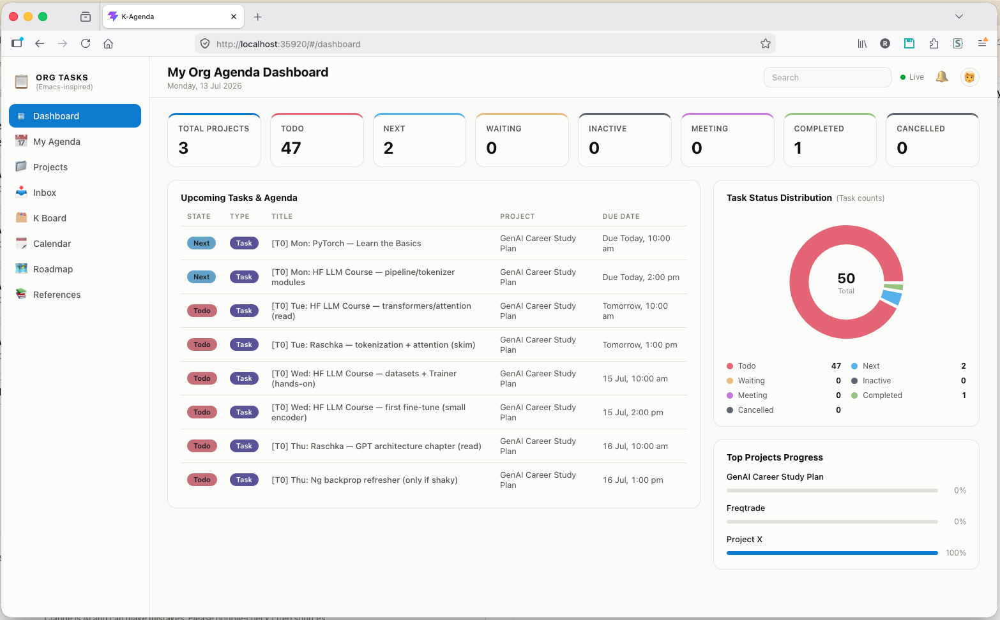
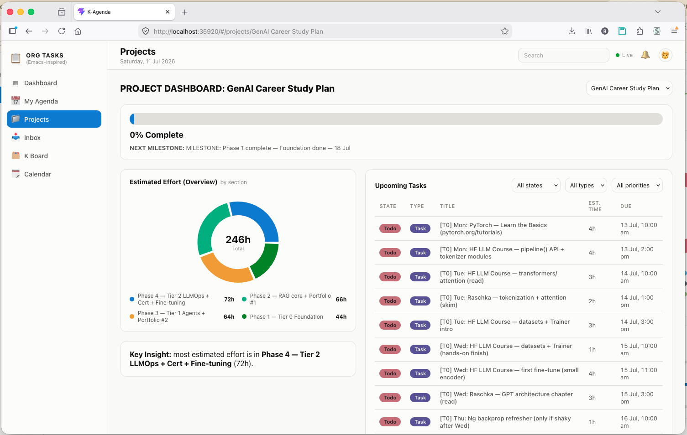
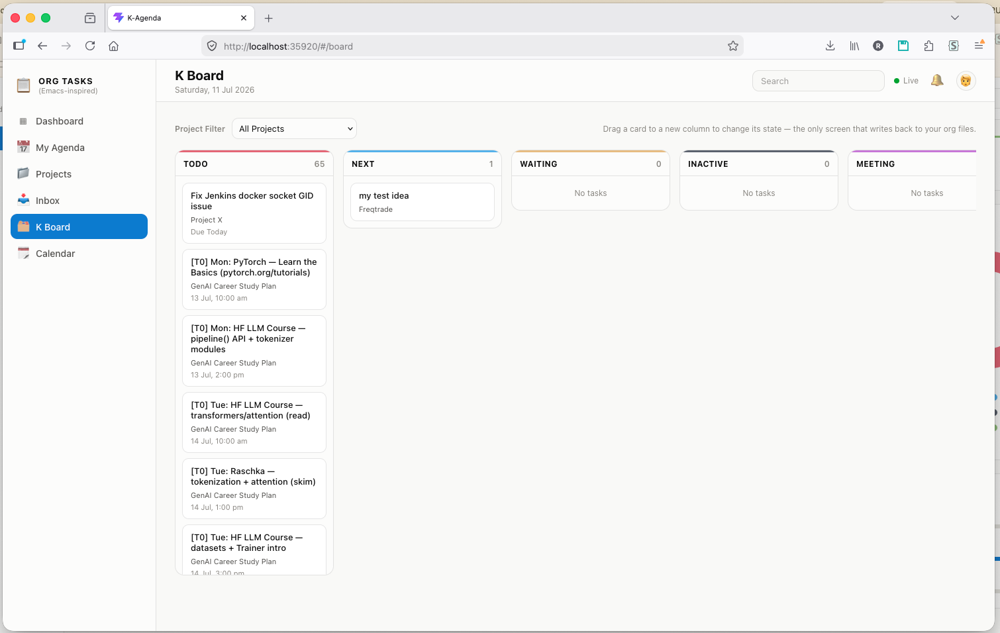
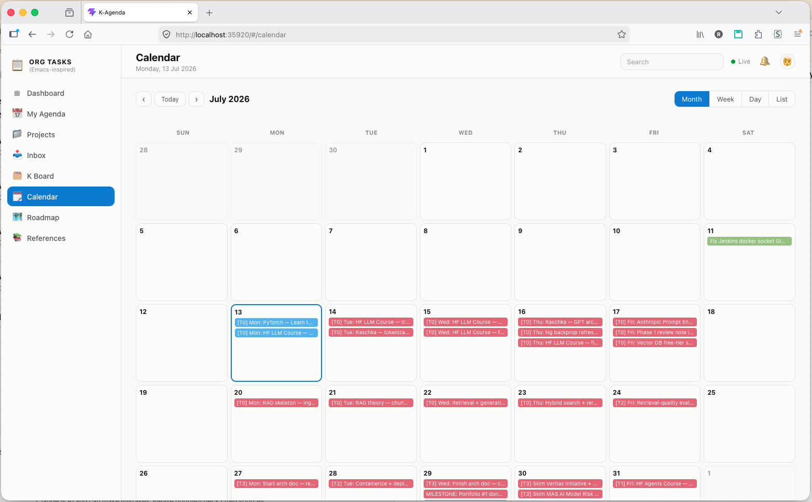
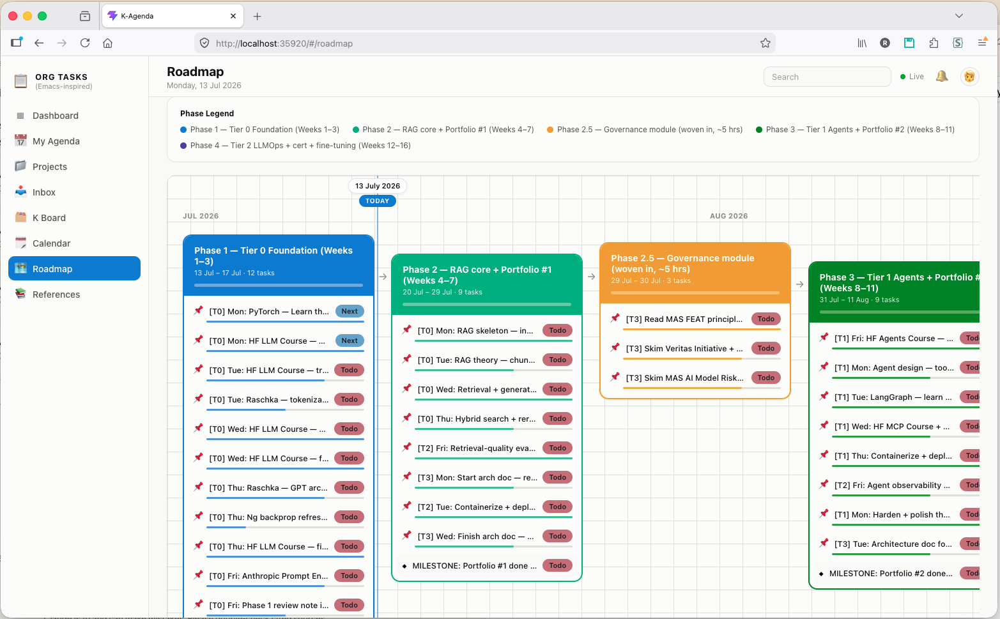
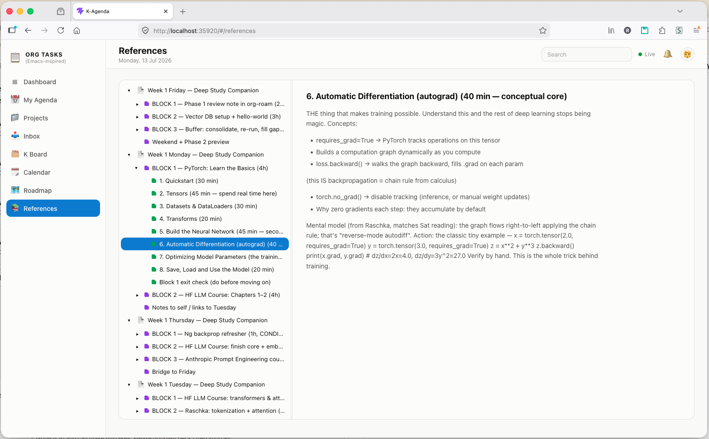

# K-Agenda

A web dashboard for `org-agenda`, in the spirit of [org-roam-ui](https://github.com/org-roam/org-roam-ui) and [org-hyperscheduler](https://github.com/dmitrym0/org-hyperscheduler): a small Elisp backend serves a React web app and pushes live updates to the browser over a websocket whenever your Org files change — no polling, no manual export/refresh step.

|                                                    |                                                    |
| -------------------------------------------------- | -------------------------------------------------- |
|                 |                |
|                    |                   |
|                    |                 |

## What it does

- **Dashboard** — stat tiles per TODO state, a status pie chart, an upcoming-tasks table, and a top-projects progress panel.
- **Projects** — one card per project, each linking to a **Project Hub**: progress bar, next milestone, an estimated-effort breakdown chart, and a filterable upcoming/overdue tasks table.
- **Inbox** — every task across your agenda files, searchable and filterable by state, type, and project.
- **K Board** — a Kanban board per TODO state. The one screen that writes back to your Org files: drag a card to a new column to change its state, gated by an explicit transition graph and re-validated server-side (see [Read-only, except K Board](#read-only-except-k-board) below).
- **My Agenda** — a 7-day strip navigator plus a table of the selected day's tasks.
- **Calendar** — Month / Week / Day / List views of everything with a `SCHEDULED`/`DEADLINE` timestamp.
- **Roadmap** — a per-project timeline: dated tasks grouped into phase cards along a month ruler, with a today-marker, a per-phase progress bar, and a milestone callout. See [Roadmap](#roadmap) below.
- **References** — a separate, read-only library for supporting docs (study notes, reading plans, anything with no `TODO` keywords) that would otherwise clutter your task list: a collapsible outline tree on the left, the selected section's body — lightly formatted — on the right. See [References](#references) below.
- **Task detail** — click any task anywhere to see its full body text (fetched on demand, not baked into every update), properties, and tags.
- **Live sync** — a task's `TODO` state changes in the browser within a fraction of a second of you pressing `C-c C-t` in Emacs, before you've even saved the file.

Everything above is **read-only** except K Board's drag-and-drop — the dashboard reflects your Org files, it doesn't replace editing them in Emacs.

## Requirements

- Emacs 27.1+
- The [`websocket`](https://elpa.gnu.org/packages/websocket.html) package (`M-x package-install RET websocket RET`)
- Node.js + npm, to build the frontend (only needed once, and again after pulling updates — nothing is required at runtime)

No dependency on `simple-httpd` or any other web server package — K-Agenda's HTTP server is self-contained, specifically so it doesn't conflict with other Emacs tools (like org-roam-ui) that also serve a local web UI. See [Coexisting with org-roam-ui](#coexisting-with-org-roam-ui-and-similar-tools).

## Installation

```sh
git clone https://github.com/<your-username>/K-Agenda.git ~/.emacs.d/site-lisp/k-agenda
cd ~/.emacs.d/site-lisp/k-agenda/web
npm install
npm run build
```

Then, in your Emacs config:

```elisp
(add-to-list 'load-path "~/.emacs.d/site-lisp/k-agenda")
(require 'k-agenda)

(global-set-key (kbd "C-c K") #'k-agenda-open)
```

`M-x k-agenda-open` (or `C-c K`) starts the backend and opens the dashboard in your browser. It reuses whatever `org-agenda-files` is already set to — no separate file list to maintain.

## Configuration

All of these are `defcustom`s, so `M-x customize-group RET k-agenda RET` works too.

| Variable | Default | Meaning |
| --- | --- | --- |
| `k-agenda-http-port` | `35920` | Port the dashboard is served on |
| `k-agenda-ws-port` | `35921` | Port the live-sync websocket listens on |
| `k-agenda-open-on-start` | `t` | Open a browser tab automatically when `k-agenda-mode` turns on |
| `k-agenda-browser-function` | `#'browse-url` | Function used to open the dashboard URL |
| `k-agenda-debounce-seconds` | `0.5` | Delay before pushing an update, to coalesce rapid successive edits |
| `k-agenda-references-dir` | `~/Documents/Org/organizer/references/` | Directory of read-only reference `.org` files shown in References — see [References](#references) below |

Commands: `k-agenda-mode` (toggle the backend on/off), `k-agenda-open` (ensure it's on, then open the browser), `k-agenda-refresh` (force an immediate re-push without waiting for an edit).

## Getting the most out of it

A few Org conventions K-Agenda understands, entirely optional but worth setting up:

### Projects

Point one entry of `org-agenda-files` at a **directory**, and every `.org` file inside it becomes its own project — no config edit needed to add a project, just add a file:

```elisp
(setq org-agenda-files
      '("~/org/projects/"      ; a directory: one project per file inside it
        "~/org/inbox.org"
        "~/org/work.org"))
```

Each project file needs one level-1 heading. A `#+TITLE:` at the top of the file is used as the project's display name if present (handy for a friendlier name than the filename); otherwise the level-1 heading text is used.

### Task type badges

The Type badge (Todo / Meeting / Diary / Idea / Task) comes from a `:CAPTURE_TYPE:` property, most easily set by your `org-capture-templates`:

```elisp
(setq org-capture-templates
      '(("t" "TODO" entry (file org-default-notes-file)
         "* TODO %?\n:PROPERTIES:\n:CAPTURE_TYPE: Todo\n:END:\n%u\n%a\n")
        ("m" "Meeting" entry (file org-default-notes-file)
         "* MEETING with %? :MEETING:\n:PROPERTIES:\n:CAPTURE_TYPE: Meeting\n:END:\n%t")
        ("d" "Diary" entry (file+datetree "~/org/diary.org")
         "* %?\n:PROPERTIES:\n:CAPTURE_TYPE: Diary\n:END:\n%U\n")
        ("i" "Idea" entry (file org-default-notes-file)
         "* %? :IDEA:\n:PROPERTIES:\n:CAPTURE_TYPE: Idea\n:END:\n%t")
        ("n" "Next Task" entry (file+headline org-default-notes-file "Tasks")
         "** NEXT %?\n:PROPERTIES:\n:CAPTURE_TYPE: Task\n:END:\nDEADLINE: %t")))
```

A heading with no `:CAPTURE_TYPE:` property just shows a blank Type badge — never guessed from anything else.

### Estimated effort

If a task has an `:Effort:` property (e.g. `4:00`), the Project Hub's effort chart picks it up automatically, grouped by each task's parent section heading.

### Roadmap

Pick a project from the dropdown and its dated tasks (anything with a `SCHEDULED` or `DEADLINE` timestamp) lay out as phase cards along a month timeline, with a live "today" marker. No extra config beyond dates:

- **Phases** are just the heading directly under the project's level-1 root — e.g. a task under `* Project X / ** Phase 1 — Foundation / *** TODO Read the docs` groups into the "Phase 1 — Foundation" card. Generic on purpose: whatever your second-level headings are named becomes the phase name.
- **Milestones** are any task whose title starts with "Milestone" or that's tagged `:milestone:` — it gets called out separately with its own countdown.
- Undated tasks in the project still count toward its totals, they just don't appear on the timeline itself (shown as a small note instead).

### References

A place for read-only supporting material — study notes, reading plans, anything that's mostly prose and doesn't belong in your task list because it has no `TODO` keywords. If you drop a plain notes file into your `projects/` directory instead, it still shows up there as a project with zero tasks (harmless, but noisy); References keeps it out of the project/task pipeline entirely.

- **File path**: `k-agenda-references-dir`, a `defcustom` like the others above — defaults to `~/Documents/Org/organizer/references/`. **Not** part of `org-agenda-files`; point it at any flat directory (non-recursive — subfolders aren't walked) and every `.org` file directly inside becomes a tree root.
- **No TODO keywords needed.** Every heading in the file becomes a collapsible tree node regardless of state, nested by outline level. A file's `#+TITLE:` (or its capitalized filename, if there's no title) is the root node's label.
- Click any node — the file root or any heading — to read its body text on the right, lightly formatted (bold/italic/underline, `#+begin_src` blocks, `|`-delimited tables, bullet lists, and links, including bare `https://` URLs, auto-linked). Drag the divider between the tree and the reader pane to resize; the split persists.
- **Search** — the box above the tree narrows the list as you type, matching file names and document text in one pass. Files matching on name or `#+TITLE:` rank ahead of files matching only on content, and matching headings surface expanded in place, so a hit deep in a document lands you on the section rather than the top of the file. Clearing the box restores the full tree. Matching is case-insensitive and literal, so a query like `c++` or `*.org` searches for exactly that.
- Edits to a reference file in Emacs live-update the tree the same way project files do — no manual refresh needed. Parsed files are cached against their mtime and size, so a save re-reads only the file you changed, and a search scans what's already in memory.

```elisp
(setq k-agenda-references-dir "~/org/references/")
```

**Windows caveat**: unlike macOS/Linux, Windows doesn't reliably set `HOME`, so `~` can expand somewhere other than your user profile (e.g. under `%APPDATA%`) — a directory that exists but silently isn't the one you meant, leaving the References tab empty with nothing in `*Messages*` to explain why. If the tab is empty on Windows, check `*Warnings*` first (a missing/misresolved `k-agenda-references-dir` is reported there), then set the path explicitly with forward slashes and the same drive-letter casing you use in `org-agenda-files`:

```elisp
(setq k-agenda-references-dir "C:/Users/<you>/Documents/Org/organizer/references/")
```

## Read-only, except K Board

Every screen is read-only — dragging is the one exception, and it's deliberately constrained. A drag is only allowed if it matches a real transition in the state graph below; anything else is blocked with an explanation before any request is even sent, and every allowed move still asks for confirmation first.

```
  INACTIVE ──► TODO ──► NEXT ──► WAITING
                 ▲        ▲          │
                 │        └──────────┤
                 └───────────────────┘

  Completed ◄── TODO, NEXT, MEETING
  Cancelled ◄── INACTIVE, TODO, NEXT, WAITING, MEETING

  MEETING is an event, not a process: it never enters the flow above, and
  only ever resolves to Completed or Cancelled.
```

The transition table (and its rejection messages) lives in `k-agenda-workflow.el`, plain data if you want to adapt it to your own workflow. The server re-validates every request independently of the browser — a mutating action never trusts client-side checks alone — and refuses the write if the task's actual current state doesn't match what the browser believed it was dragging from, so a stale page can't silently mutate the wrong heading.

## Coexisting with org-roam-ui and similar tools

`simple-httpd` — used by org-roam-ui and several other Emacs web-UI packages — keeps its server in a single global variable, and starting it unconditionally kills whatever server was already running under it. K-Agenda deliberately does **not** use `simple-httpd`; its HTTP server is a small, self-contained implementation with its own process, so it won't fight org-roam-ui (or anything else built on `simple-httpd`) for the same shared slot. Both can run at once.

## Architecture

```
k-agenda.el            entry point: defcustoms, k-agenda-mode, k-agenda-open
k-agenda-model.el       walks org-agenda-files, builds the data model (pure, no I/O)
k-agenda-protocol.el    data model -> JSON wire format
k-agenda-server.el      static file server (independent of simple-httpd)
k-agenda-ws.el          live-sync websocket: broadcasts on save / TODO state change
k-agenda-workflow.el    K Board's drag-and-drop transition rules
web/                    React + TypeScript + Vite frontend, built to out/
```

The backend and frontend talk over a single websocket. On connect, the browser gets a full snapshot; after that, `org-after-todo-state-change-hook` and `after-save-hook` (scoped to `org-agenda-files`) trigger a fresh, debounced broadcast to every connected tab. A task's full body text is fetched on demand, only when its detail view is opened — not included in every broadcast, since some task bodies are long.

## Development

```sh
cd web
npm run dev      # Vite dev server with HMR; connects to the same live websocket
npm run build    # outputs to ../out, which k-agenda-server.el serves
```

Elisp tests (no Emacs GUI needed):

```sh
emacs -Q --batch -L . -l ert \
  -l k-agenda-workflow.el -l k-agenda-workflow-test.el \
  -l k-agenda-model.el -l k-agenda-model-test.el \
  -l k-agenda-protocol.el -l k-agenda-protocol-test.el \
  -f ert-run-tests-batch-and-exit
```

## License

[GNU General Public License v3.0](LICENSE)
